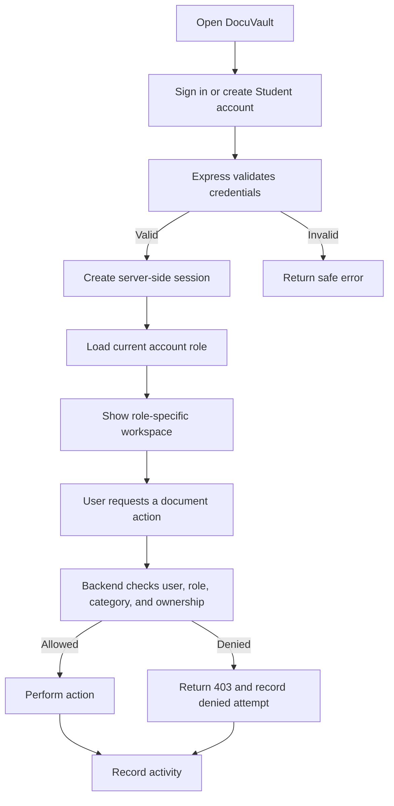
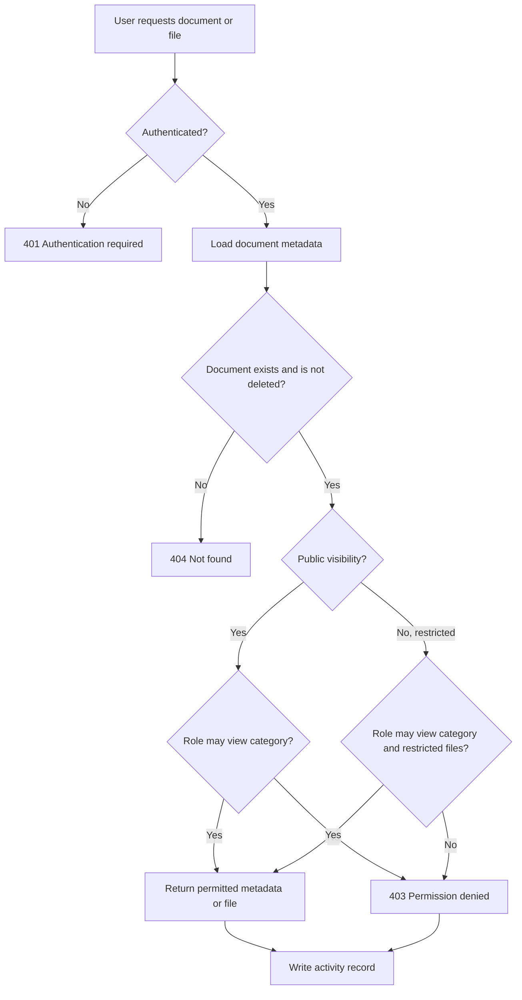
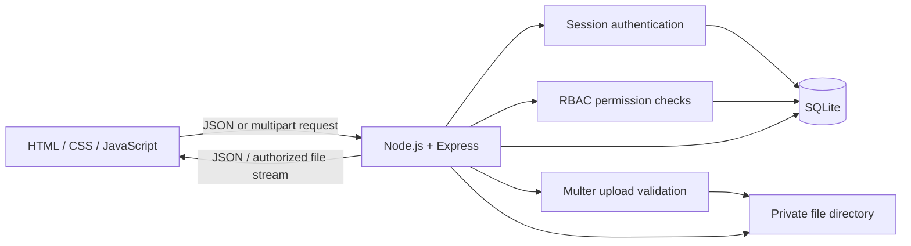

# System Workflow & Architecture Diagrams

## General sign-in and role workflow

```mermaid
flowchart TD
    A[Open DocuVault] --> B[Sign in or create Student account]
    B --> C[Express validates credentials]
    C -->|Valid| D[Create server-side session]
    C -->|Invalid| E[Return safe error]
    D --> F[Load current account role]
    F --> G[Show role-specific workspace]
    G --> H[User requests a document action]
    H --> I[Backend checks user, role, category, and ownership]
    I -->|Allowed| J[Perform action]
    I -->|Denied| K[Return 403 and record denied attempt]
    J --> L[Record activity]
    K --> L
```

## Document access workflow

```mermaid
flowchart TD
    A[User requests document or file] --> B{Authenticated?}
    B -->|No| C[401 Authentication required]
    B -->|Yes| D[Load document metadata]
    D --> E{Document exists and is not deleted?}
    E -->|No| F[404 Not found]
    E -->|Yes| G{Public visibility?}
    G -->|Yes| H{Role may view category?}
    G -->|No, restricted| I{Role may view category and restricted files?}
    H -->|No| J[403 Permission denied]
    I -->|No| J
    H -->|Yes| K[Return permitted metadata or file]
    I -->|Yes| K
    K --> L[Write activity record]
    J --> L
```

## Client-server architecture

```mermaid
flowchart LR
    Browser[HTML / CSS / JavaScript] -->|JSON or multipart request| Express[Node.js + Express]
    Express --> Auth[Session authentication]
    Express --> RBAC[RBAC permission checks]
    Express --> Upload[Multer upload validation]
    Auth --> DB[(SQLite)]
    RBAC --> DB
    Upload --> Private[Private file directory]
    Express --> DB
    Express --> Private
    Express -->|JSON / authorized file stream| Browser
```
